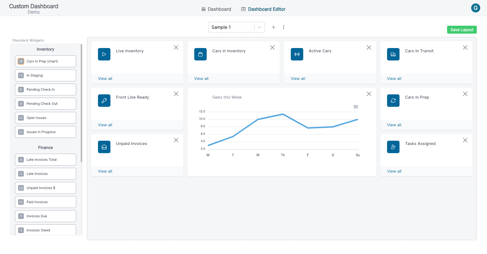

    </a>    

<h1 align="center">Dashboard Editor - Create a Custom Dashboard</h1>

<section align="center">
  
  </section>
  
<h2 align="center">Features</h2>

### Features:

- This was a project that I built at work. Decided to set it up in it's own environment and host it so that I can showcase it on portfolio.
- The reordering of widgets is done using the react-grid-layout library for React.
- When you login as a guest, you can create dashboards and add/ move around widgets and save dashboards.
- For this demo project, guest accounts get deleted at a later time.

This work is licensed under a <a href="https://creativecommons.org/licenses/by-nc/4.0/legalcode" target="_blank">Creative Commons Attribution-NonCommercial 4.0 International License</a>.
