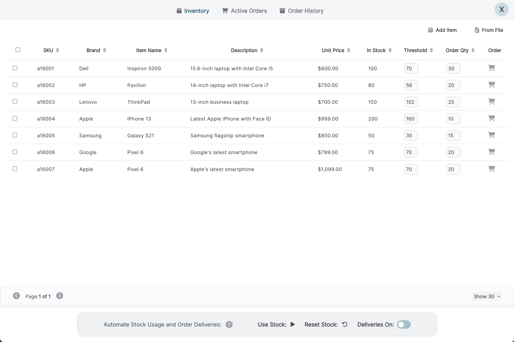

    </a>    

<h1 align="center">Inventory Copilot - Manage Inventory and Automate Orders</h1>

This web application enables businesses to automate orders for products when their in-stock quantity hits a target point. Once an order is placed, the user is notified of the expected arrival date. What sets Orderly apart from other automation technologies are the following features:

<section align="center">
<!-- <a href="https://orderlyapp.netlify.app/" target="_blank" rel="noreferrer"> -->
  
<!-- </a> -->
  </section>
  
<h2 align="center">Features</h2>

### Inventory tracking:

- Pin inventory items to the top of the list for easy access.
- Filter inventory items by SKU, brand, or quantity in ascending or descending order.
- Add, edit, and delete inventory items.
- Upload and delete inventory items in bulk using a CSV file and a checkbox selection popup.
- Search for product or order by any matching keyword with search bar.
- Visualize product stock and target quantities using an interactive chart.

### Inventory and Orders:

- View active orders from the inventory page.
- Highlight inventory items and their corresponding orders with the same color for easy tracking.
- Edit the "target" and "reorder at" points of each product and the amount to be ordered.

### Order automation:

- Automatically create orders when an item's target point is reached.
- Create additional orders at multiple points below the target point (40% to 70% and 0% to 40% of stock) to maintain inventory levels.

### Manual Orders and Deliveries:

- Create one-time orders with a desired quantity via the "order now" popup.
- Mark orders as delivered to increase the "In Stock" amount and move them to the order history section.

<h2 align="center">Misc</h2>

### License

This work is licensed under a <a href="https://creativecommons.org/licenses/by-nc/4.0/legalcode" target="_blank">Creative Commons Attribution-NonCommercial 4.0 International License</a>.
